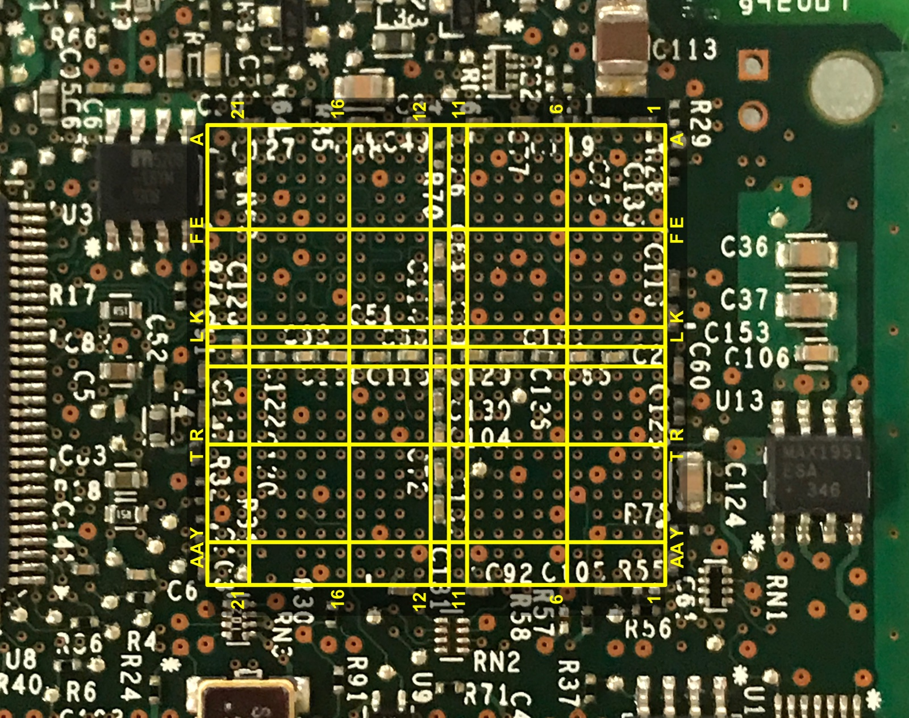

# CISCO VWIC2-2MFT-T1/E1 WAN Card

The goal of this project was to reverse engineer the Cisco VWIC2-2MFT-T1/E1 WAN card. These are
plug-in board that slide into a standard HWIC slot of a Cisco routers.

These boards can be found for $5 on eBay and when properly reverse engineered, they'd be perfect
board for hobby FPGA applications.

Except for one thing: while Intel lists that Stratix-II FPGA are supported with the Quartus Web Edition
11.0sp1, this is only true for the EP2S15 FPGA, **not the EP2S30 FPGA**! For that one, you need the
expensive Quartus Standard Edition.

And that makes reverse engineering this board pretty much useless... I obviously only figured this
out after already spending a healthy number of ours of working on the reverse engineering the board.

For posterity's sake, here's the information that I was able to tease out of the PCB.

## FPGA Board Hack

I found out about this board through the [FPGA Board Hack](https://hackaday.io/project/159853-fpga-board-hack)
project.

It lists a number of commercial projects that have an FPGA in them, and it has a decicated log
about [Cisco VWIC3-2MFT](https://hackaday.io/project/159853-fpga-board-hack/log/161719-stratix-ii-cisco-vwic3-2mft),
but no real practical information about how to wire things up, or which IOs can be used.

## PCB Components

PCB Top:

PCB Bottom:

Main Active Components:

* Altera Stratix II EP2S30F484C5N FPGA

* ISSI IS64LPS25636A 256K x 36 200MHz SRAM

    * [Datasheet](https://datasheet.octopart.com/IS61VPS25636A-200TQLI-ISSI-datasheet-8372950.pdf)

* PMC Sierra Comet Dual T1/E1 Framer/Line Driver

* 2.0480 MHz Xtal

Power Regulators:

* ISL6420AIRZ Buck PWM Controller

* BSC150N03LD Dual MOSFET Power Transistor

    Controller by ISL

    Input Ext 12V -> 3.3V (SRAM VDD etc.) -> 1.2V (FPGA VCCINT)

* Micrel M5209-1.8YM 1.8V LDO

    Input Ext 3.3V -> 1.8V (FPGA VDDPD)

* MAX1951 Switched Regulator 

    Input Ext 5V -> ?

Extra stuff:

* TRXCOM MD-R0090R Dual Line Transformer

* CV9606

    Texas Instruments custom part for Cisco?

## Cisco HWIC Connector

The CISCO HWIC connector has 2 rows with pins that are 1.26mm spaced, and 1 row with pins that are 2.56mm spaced. 

AFAIK, this top row is only used for power delivery: 12V, 5V, and 3.3V.

There are CISCO board that only have the bottom 2 rows. From what I've measured, the bottom 2 rows only contain a 12V
supply, no 5V or 3.3V pins.

## Power

In theory, you need 3 external power supplies to feed this thing: 12V, 5V, and 3.3V.

However, you can get away with only 5V by doing this:

* Connect the 12V to 5V.

    The 12V goes into a power regulator that creates 3.3V. When you dial down the voltage on your external
    power supply from 12V to 5V, the regulator still outputs 3.3V.

* Connect the 3.3V that comes out of the 3.3V regulator to the external 3.3V input

    It's unclear why there is an external 3.3V and an internally generated 3.3V. 
    But everything seem to work by tying them together (as far as I could tell.)

## FPGA pinout

## FPGA Pin Assigment

N20: Xtal 2.0480 MHz

